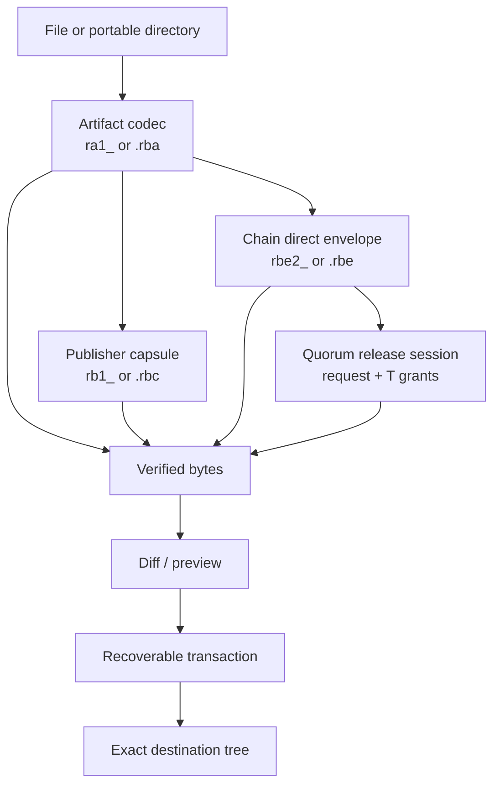
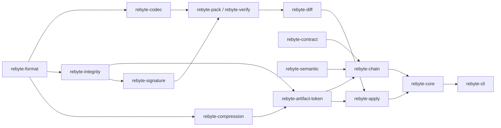
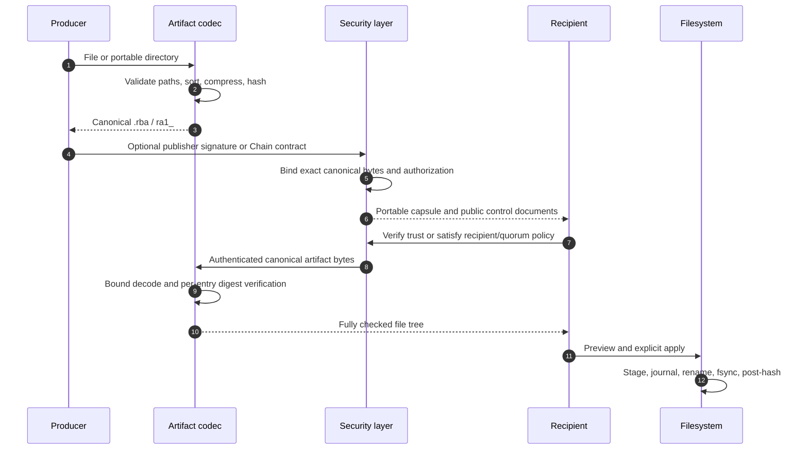
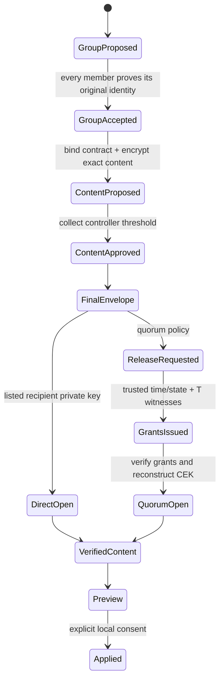

# Rebyte system architecture

Copyright (c) 2026 Pedro Martins (pedro5g)

This document is the entry point for the implemented Rebyte architecture. It
connects the simple artifact, publisher, transactional filesystem, semantic
patch and encrypted consensus layers without changing their independent trust
boundaries.

Rebyte is local-first and performs no network access, command execution,
lifecycle hook or generated-code interpretation. Transport is deliberately
external: users may move tokens, files and signed control documents over any
channel.

## Trust ladder

Choose the lowest layer that provides the required property. Adding a higher
layer never turns an integrity digest into an identity or a signature into
encryption.

| Layer | Format | Provides | Does not provide |
|---|---|---|---|
| Artifact | `ra1_`, `.rba` | compression, bounds, byte-exact integrity | author identity or secrecy |
| Publisher | `rb1_`, `.rbc` | Ed25519 authorship and local trust policy | confidentiality |
| Chain direct | `rbe2_`, `.rbe` | encrypted multi-recipient delivery and group approval | fresh consent for each open |
| Chain quorum | `.rbe` plus request/grants | fresh `T-of-N` key release, optional time/count policy | deletion after plaintext release |
| Filesystem transaction | journal below `.rebyte/` | bounded staging, per-file atomic replacement, rollback/recovery | one global multi-file atomic rename |
| Semantic patch | `.rbp.json` or encrypted Chain content | typed JSON/TOML logical operations and preconditions | arbitrary code execution |



## Component boundaries



| Crate | Security responsibility |
|---|---|
| `rebyte-format` | bounded protocol types, portable paths and limits |
| `rebyte-codec` | strict canonical RAP v1 binary/text encoding |
| `rebyte-integrity` | domain-separated BLAKE3 identities |
| `rebyte-compression` | deterministic and output-bounded compression |
| `rebyte-artifact-token` | definitive unsigned file/directory artifact |
| `rebyte-signature` / `rebyte-signer` | Ed25519 trust policy and protected publisher keys |
| `rebyte-contract` | canonical participants, capabilities and release policy |
| `rebyte-chain` | identities, HPKE, encrypted content, approvals and quorum release |
| `rebyte-semantic` | non-executable JSON/TOML patch language |
| `rebyte-verify` | RAP typestate verification before content release |
| `rebyte-diff` / `rebyte-apply` | preview and recoverable capability-based writes |
| `rebyte-core` | stable application facade |
| `rebyte-cli` | user consent, local key I/O, reports and shell integration |
| `rebyte-wasm` | browser-safe unsigned pack/structure-only boundary |

Production crates forbid unsafe Rust. Parsers reject unknown versions,
algorithms, flags, fields, duplicates, non-canonical ordering, truncation and
trailing bytes.

## Canonical data lifecycle

The same source bytes can enter different security layers:



An unsigned artifact is safe for reconstruction only after its internal
digests pass, but remains unauthenticated. A RAP capsule is safe for a
publisher trust decision only after complete signature and policy verification.
A Chain envelope releases plaintext only after its group certificate, exact
contract, approvals, recipient and AEAD are all verified.

## Contract and consensus model

Chain intentionally separates four roles:

```text
controllers  = identities allowed to approve the exact encrypted proposal
recipients   = identities allowed to receive released content
witnesses    = identities holding shares for a fresh quorum release
capabilities = operations allowed after content verification
```

Group formation is unanimous. Every proposed member signs the same canonical
`GroupId` with the private signing key corresponding to the originally shared
public identity. Capsule creation then requires the configured controller
threshold over one exact `ProposalId`.

The Access Contract binds the complete controller set, proposal threshold,
recipients, capabilities, content kind, plaintext digest/length and release
policy. Changing any of these values changes the contract and proposal IDs and
invalidates existing approvals.



Direct release is offline and non-interactive after finalization. Quorum
release keeps the content-encryption key split until a fresh recipient-signed
request receives the exact witness threshold. Finite release limits require
all witnesses in Access Contract v1, preventing two partially overlapping
quorums from independently consuming the same ordinal without shared global
consensus.

## Time and single-release boundary

`not-before` is represented as non-negative Unix milliseconds. This is an
interchange format, not proof that a clock is honest. The Rust API therefore
requires explicit `TrustedClock` and `ReleaseLedger` providers.

The CLI file ledger and OS clock are a cooperative development authority,
enabled only with `--acknowledge-local-authority`. Strong production behavior
requires independently protected witness hosts, authenticated time and
rollback-resistant monotonic state.

`maximum_successful_releases = 1` authorizes at most one fresh key-release
request in that authority. It cannot make retained grants, the CEK or plaintext
disappear. No software on an untrusted recipient device can force a copied
secret to become unreadable after it was legitimately opened.

## Filesystem commit boundary

Verified bytes do not directly overwrite a destination. Rebyte:

1. confines operations below an explicitly opened root;
2. rejects symlink traversal and reserved internal paths;
3. computes precondition digests;
4. stages new files on the same filesystem;
5. persists a versioned journal and synchronizes it;
6. revalidates preconditions before each rename;
7. atomically replaces each individual file;
8. synchronizes committed files and relevant directories;
9. hashes the committed result;
10. records completion or retains enough state for recovery.

The set is recoverable, not globally atomic. A crash between two file renames
may expose a partial set until `resume` or `rollback` completes.

## Production acceptance boundary

The implementation is designed to fail closed and is covered by unit,
property, integration, mutation/fuzz harnesses and a multi-platform CI matrix.
It has not received an independent cryptographic or filesystem audit.

Before using Rebyte for high-value secrets, require:

- independent review of the wire formats, HPKE/AEAD binding and Shamir release;
- stable cross-language test vectors for every canonical control document;
- HSM/KMS or equivalent protection for long-lived private signing material;
- rollback-resistant time and release-ledger adapters on independent witnesses;
- verified offline recovery copies and rehearsed rotation/revocation;
- signed release artifacts, checksum, SBOM and provenance verification;
- an application-specific threat model for endpoints, backups, logs and users.

Operational deployment is detailed in [Chain operations](chain-operations.md).
Algorithm-level behavior is specified in
[Chain v2](../schemas/chain-v2.md) and
[Access Contract v1](../schemas/access-contract-v1.md).
