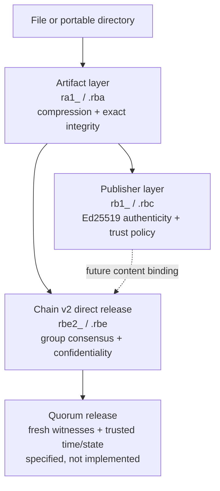
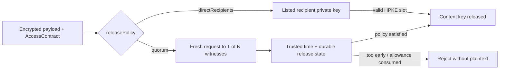
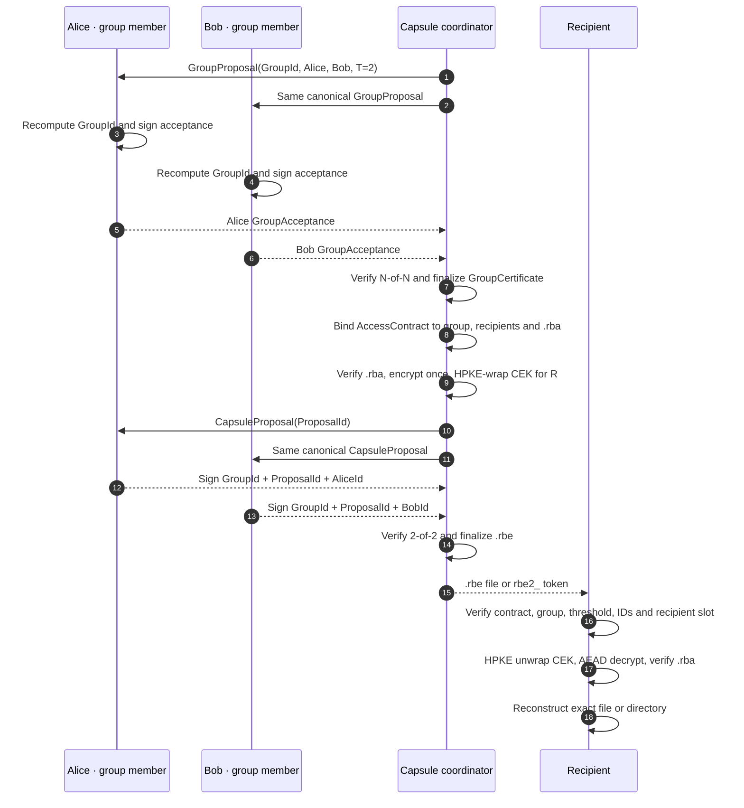
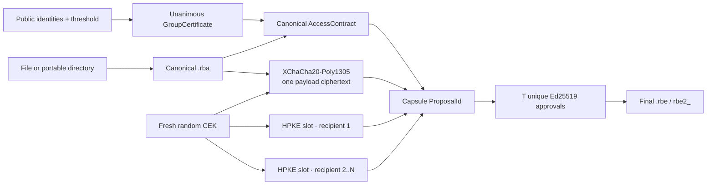

# Rebyte Chain architecture

Status: Chain envelope v2 and Access Contract v1 are implemented by
`rebyte-contract`, `rebyte-chain`, `rebyte-core` and the `rebyte chain` CLI.
Direct recipient release is functional. The later signed event graph and
interactive quorum release described as roadmap are not implemented by
envelope v2.

Rebyte Chain is a local-first, self-custodied system for sharing byte-exact
Rebyte artifacts with explicit cryptographic authorization and recipients. The
implemented layer is an offline encrypted envelope. A later history layer may
form an append-only, signed Merkle directed acyclic graph (DAG). Chain is not a
cryptocurrency, public blockchain or global source of consensus.

The design keeps four properties independent:

1. BLAKE3 content identifiers detect substitution and corruption.
2. Ed25519 signatures authenticate an identity and its decisions.
3. Hybrid public-key encryption provides confidentiality to recipients.
4. Access policies define which independently authenticated participants must
   cooperate.

Combining these properties in one object does not make them interchangeable. A
signature does not encrypt data, a digest cannot reconstruct data, and a local
event log cannot prove that a remote recipient deleted plaintext.

## Product boundary

Chain envelope v2 provides:

- any number of independent self-custodied identities;
- passphrase-encrypted portable `.rbk` private bundles;
- self-signed public packages binding Ed25519 and X25519 keys;
- unanimous `N-of-N` group formation proof;
- configurable `T-of-N` authorization of each exact encrypted proposal;
- an immutable contract binding group, threshold, recipients, capabilities,
  plaintext digest/size and content-key release mechanism;
- one ciphertext shared with one or many explicitly listed recipients;
- the existing byte-exact `.rba` file or directory artifact as content;
- canonical binary `.rbe`, textual `rbe2_` and strict control documents;
- native Rust and CLI APIs with no network dependency.

Envelope v2 does not provide:

- proof of work, mining, tokens or a globally replicated ledger;
- a trusted global timestamp or total ordering of offline events;
- permanent revocation of plaintext a recipient already recovered;
- enforceable single-use or self-destruction on an untrusted device;
- anonymity against traffic analysis, file-size analysis or a malicious
  application origin;
- automatic semantic merging of file contents;
- threshold approval at every open, threshold secret sharing, FROST, MLS,
  hardware enclaves or a network relay;
- the signed Merkle event graph or a Chain WebAssembly storage API.

Semantic patches remain a separate, signed content type. They can later be
carried inside a Chain envelope without giving the patch language authority to
execute code.

## Modular security layers

Applications select the lowest layer that supplies the property they need.
Higher layers contain or bind lower-layer canonical bytes; they do not change
what a digest, signature or encryption primitive means.



| Requirement | Artifact | Signed RAP | Chain direct | Quorum release |
|---|:---:|:---:|:---:|:---:|
| Byte-exact reconstruction | yes | yes | yes | yes |
| Corruption detection | yes | yes | yes | yes |
| Publisher authenticity | no | yes | group approval | group approval |
| Confidentiality | no | no | listed recipients | released session |
| Open only after a date | no | no | no | witness-enforced |
| At most one key release | no | no | no | stateful witnesses |
| Force deletion after reading | no | no | no | no on an untrusted endpoint |

The final row is a hard boundary: software cannot revoke bytes that an
authorized, hostile endpoint has already copied. Trusted hardware can narrow
that boundary only while every plaintext use remains inside the hardware.

## Terminology and object model

### Identity

An identity is a local label associated with independent purpose-specific key
pairs:

- an Ed25519 signing key for authorship, approvals and graph events;
- an X25519 key-encapsulation key for receiving encrypted key material.

Encryption and signing keys MUST be distinct. A `KeyId` is a domain-separated
32-byte fingerprint of the algorithm, purpose and canonical public key. Names,
avatars and contact information are local metadata unless included in a signed
identity statement.

Users MAY keep multiple identities and multiple active, retired or revoked keys
for each identity. Rebyte MUST NOT derive a new private key by concatenating,
XORing or otherwise improvising over existing private keys. Requiring several
keys is represented by an access policy.

### Key bundle

An `.rbk` key bundle is a canonical, versioned document containing public
identity data and encrypted private seed material. Argon2id v1.3 derives the
XChaCha20-Poly1305 key directly from the passphrase and a random salt. Version
1 fixes 64 MiB, three iterations and one lane. Parameters, salt, nonce and the
complete public identity are authenticated as associated data.

Unlock validates public/private correspondence, canonical encoding,
algorithms, limits and KDF parameters before returning an in-memory identity.
CLI creation is exclusive, uses restrictive permissions where the platform
exposes them, synchronizes the completed file and never prints private
material.

Losing every private bundle and recovery copy makes the encrypted data
unrecoverable. Self-custody removes a central recovery authority; it does not
remove the need for verified offline backups.

### Encrypted envelope

An `.rbe` Rebyte Encrypted Envelope contains:

- fixed magic, protocol version, suite identifiers and strict limits;
- the complete unanimously accepted group certificate;
- the canonical Access Contract and its domain-separated `ContractId`;
- the digest and length of one canonical inner `.rba` artifact;
- one HPKE slot per explicitly authorized recipient;
- one XChaCha20-Poly1305 ciphertext of the complete `.rba`;
- `T` or more unique group-member approvals;
- proposal and envelope identifiers committing every security field.

The encoder generates a fresh random 256-bit content-encryption key (CEK) for
every envelope. The artifact is encrypted once. Recipient slots encapsulate
only CEK-related key material, so adding recipients does not duplicate a large
payload.

Recipient slots use HPKE as specified by
[RFC 9180](https://www.rfc-editor.org/rfc/rfc9180), using a registered X25519
ciphersuite: X25519-HKDF-SHA256, HKDF-SHA256 and ChaCha20-Poly1305 in Base
mode. The payload uses XChaCha20-Poly1305. Suite identifiers reject algorithm
substitution.

Compression MUST finish before encryption. Ciphertext is intentionally
incompressible, and compressed size can reveal information. Applications MUST
not automatically expose secret-dependent compression to attacker-controlled
plaintext in an interactive oracle.

## Group authorization and recipient access

Chain envelope v2 has three intentionally independent sets:

```text
Group {
    members: sorted unique public identities
    capsule_approval_threshold: T
}

Recipients {
    identities: sorted unique public identities
}

Contract {
    exact_content_commitment
    capabilities
    release_policy
}
```

Group formation is always unanimous. Each proposed member independently
recomputes the same `GroupId` and signs `GroupId || MemberIdentityId` with the
private Ed25519 key corresponding to its original public package. Substituting
another private key invalidates the certificate.

`1 <= T <= N` is mandatory. For each capsule, `T` unique group members sign
the exact `GroupId || ProposalId || MemberIdentityId`. The `ProposalId`
commits the group certificate, inner artifact, complete recipient list, HPKE
slots and ciphertext. Approvals cannot be replayed onto another proposal.

Every recipient receives an HPKE wrapping of the same random CEK and can open
independently after the envelope has been finalized. A group member is not
automatically a recipient, and a recipient is not automatically allowed to
approve. This distinction permits, for example, two release officers to
authorize encrypted delivery to ten customer identities.

If a product requires `T-of-N` cooperation at every open, the CEK must instead
be split by a reviewed threshold secret-sharing construction and exchanged in
a fresh, replay-resistant opening session. That protocol is not present in
envelope v2. Signatures alone cannot enforce it, and Rebyte does not label
capsule-finalization approvals as opening shares.

FROST, specified
by [RFC 9591](https://www.rfc-editor.org/rfc/rfc9591), can later make one
threshold signature compact, but it requires purpose-built key shares,
coordinated setup and two interactive signing rounds. It cannot safely turn an
arbitrary collection of existing private keys into one group key.

Release policy controls where the CEK remains unavailable:



Envelope v2 implements the upper direct branch and rejects the quorum branch.
It never substitutes the local wall clock or a local counter for the missing
witness protocol.

## Implemented flow



The data and authorization paths meet only in the finalized envelope:



## Signed Merkle event graph

The remainder of this section is roadmap, not an envelope v2 capability.

Every state transition is a canonical event:

```text
Event {
    version
    kind
    parents[]       // sorted unique EventIds
    author_key_id
    lamport_counter
    wall_time_ms?   // display metadata only
    body_digest
    signature
}

BodyId = BLAKE3("rebyte chain event body v1" || canonical_event_without_signature)
Signature = Ed25519("rebyte chain event signature v1" || BodyId)
EventId = BLAKE3("rebyte chain event id v1" || BodyId || Signature)
```

Initial event kinds are:

- identity created;
- key added, retired or revoked;
- envelope created or shared;
- opening requested;
- approval granted or refused;
- graph heads merged.

Parent identifiers and Lamport counters establish causal order without trusting
a device clock. Optional Unix milliseconds help humans but MUST NOT decide key
validity, conflict winners or authorization. Zeptosecond timestamps add digits,
not trust: ordinary hardware cannot measure them meaningfully and offline clocks
can be wrong or malicious.

Two devices can create valid events while disconnected. This creates branches,
not corruption. A merge event references every accepted head. Deterministic
validation verifies each parent, signature, counter and object digest; policy
decisions remain explicit when histories conflict.

The graph proves that the retained events have not been silently edited. It
does not prove that every real-world action was recorded, that a remote clock
was correct, or that all peers agree on one canonical history.

## Local-first browser application

This section is roadmap; the native envelope does not yet expose Chain private
keys or persistence to WebAssembly.

The web application is a static, installable PWA. After a verified initial
load, a service worker may make the interface available offline. IndexedDB
stores canonical encrypted objects, graph events, public contacts and encrypted
key bundles. Plaintext and unwrapped keys MUST remain in memory only for the
shortest practical operation and be zeroized on lock where the runtime permits.

IndexedDB encryption protects data at rest. It does not protect an unlocked
vault from JavaScript served by the same origin, malicious browser extensions,
browser compromise, screen capture or memory inspection. WebAssembly shares
the browser security boundary and is not a hardware enclave.

For high-value self-custody, distribution should add:

- pinned and signed desktop builds;
- reproducible build evidence and signed updates;
- a strict Content Security Policy with no third-party scripts;
- no telemetry and no network access after the application shell is loaded;
- an independently reviewable self-hosted build;
- explicit lock, export and backup ceremonies.

Web Crypto and non-extractable platform keys MAY protect a local device key,
but non-extractability cannot replace the portable encrypted backup required by
the self-custody model. Browser storage follows the
[IndexedDB specification](https://www.w3.org/TR/IndexedDB-3/); cryptographic
integration must account for the threat model and algorithm requirements in
the [Web Cryptography specification](https://www.w3.org/TR/WebCryptoAPI/).

## Verification and opening pipeline

No plaintext reaches a destination until all applicable stages succeed:

1. Decode the bounded, canonical envelope without allocating from untrusted
   lengths.
2. Verify suite identifiers, strict ordering, unique identities and every
   public identity proof.
3. Recompute the `GroupId` and verify unanimous group formation.
4. Recompute the `ProposalId` and verify at least `T` unique group approvals.
5. Match the opener to one exact recipient slot.
6. HPKE-decapsulate the CEK without exposing it in output or errors.
7. Authenticate and decrypt the payload in bounded memory.
8. Verify exact length and the domain-separated artifact digest.
9. Decode the inner `.rba` and verify its root and per-file BLAKE3 digests.
10. Reconstruct with the existing exclusive-output, no-symlink artifact
    decoder.

Failure at any stage returns a typed, non-secret error and creates no output.
Authentication failures do not reveal partial CEK or plaintext bytes.

## Revocation and rotation

The rules below are roadmap for the signed event graph; envelope v2 has no
key-status event or trusted online revocation check.

Key status is an authenticated graph event and local trust decision:

- `active` keys may receive new envelopes and approve sessions;
- `retired` keys may open historical envelopes but not receive new ones;
- `revoked` keys are rejected at or after a locally trusted revocation event.

Offline revocation is not retroactive. A peer that never receives the event can
continue using its prior state, and revocation cannot erase already recovered
plaintext. Rotating a member or threshold requires a new policy and rewrapping
or re-encrypting the relevant CEK material.

Long-lived asynchronous groups with forward secrecy and post-compromise
security are a later problem. Rebyte SHOULD evaluate Messaging Layer Security,
[RFC 9420](https://www.rfc-editor.org/rfc/rfc9420), rather than inventing a
group ratchet.

## Implemented CLI boundary

```console
rebyte chain identity generate|inspect
rebyte chain group create|accept|finalize|inspect
rebyte chain capsule create|approve|finalize|inspect|open
```

Every output is created exclusively and never replaces an existing path. JSON
output is versioned. Passphrases are read from an interactive terminal or a
protected file, not ordinary command-line arguments or environment variables.
Run any level with `-h` for contextual options; the full reference is
[docs/cli.md](cli.md).

## Implementation gates

Completed gates:

1. separate self-proving Ed25519/X25519 identities and encrypted `.rbk`;
2. unanimous group formation bound to every original public identity;
3. RFC 9180 HPKE recipient slots and authenticated payload encryption;
4. one ciphertext for canonical multi-recipient delivery;
5. exact-proposal `T-of-N` approvals with duplicate and replay rejection;
6. native Rust facade, complete CLI workflow and end-to-end reconstruction;
7. mutation, representative truncation, wrong-key, threshold and fuzz-harness
   coverage.

Remaining independent gates:

1. independent cryptographic review and stable cross-language vectors;
2. session-bound threshold opening with reviewed secret sharing;
3. signed Merkle DAG, offline fork/merge and revocation semantics;
4. read-only WASM codecs and encrypted IndexedDB repository;
5. PWA only after native and WASM vectors match byte for byte.

Each gate requires canonical round trips, mutation and truncation rejection,
wrong-key indistinguishability, nonce-uniqueness checks, threshold boundary
tests, replay tests, fuzzing, secret-zeroization review, browser vectors and
the full Linux, macOS and Windows CI matrix.
