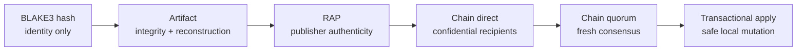

# Rebyte concepts and problem map

Copyright (c) 2026 Pedro Martins (pedro5g)

This guide explains what Rebyte solves, which layer to choose and where each
security guarantee begins and ends. Rebyte is a local-first toolkit for
transporting, authenticating, encrypting, approving, reconstructing and safely
applying exact file trees. It is not a network, cloud account, cryptocurrency,
DRM system or replacement for endpoint security.

## The problems Rebyte solves

| Need | Rebyte primitive | Result |
|---|---|---|
| Move one file as text | `ra1_` Artifact Token | reversible compressed string with exact integrity |
| Move a large file or directory | `.rba` artifact | bounded streaming reconstruction with portable paths |
| Prove who published a directory | RAP `.rbc` / `rb1_` | Ed25519 authorship plus local trust policy |
| Share a secret with selected people | Chain `.rbe` / `rbe2_` | one encrypted payload, individually wrapped access |
| Require group approval to publish | Chain group and proposal | `T-of-N` signatures over one exact encrypted proposal |
| Require fresh cooperation to open | quorum release | recipient request plus `T` encrypted witness grants |
| Delay opening until a date | quorum `not-before` | witnesses enforce trusted Unix-millisecond time |
| Bound fresh openings | quorum release allowance | durable witness state counts distinct sessions |
| Preview before writing | diff | sanitized exact or semantic change report |
| Apply without blind overwrite | transaction journal | staging, preconditions, recovery and per-file atomic rename |
| Change structured configuration | Semantic Patch v1 | typed JSON/TOML operations without executing code |

A 32-byte BLAKE3 hash identifies and checks an artifact but cannot reconstruct
arbitrary source bytes. A reversible token necessarily carries the information
needed to recover those bytes, so incompressible input produces a large token.
For large artifacts use `.rba`; shells are not a binary transport.

## Trust ladder

Select the lowest sufficient layer:



Properties do not silently “upgrade”. An Artifact digest is not a signature.
A signature is not encryption. Encryption to a recipient does not require
fresh group consent. A time field is not trustworthy unless independent
witnesses have protected clocks and rollback-resistant state.

## Core concepts

### Hash

`rebyte hash` emits a domain-separated BLAKE3 digest. It detects any byte
change and supports comparison, indexing and preconditions. It is one-way and
carries no author identity.

### Artifact

An Artifact is the canonical unsigned representation of one file or portable
directory. It binds exact bytes, relative paths, executable flags, compression,
optional embedded dictionary and resource limits. `ra1_` is its textual form;
`.rba` is its binary form. Neither is confidential or authenticated.

### RAP capsule

RAP v1 signs a deterministic directory manifest and compressed payload. The
publisher key ID selects a local trust entry; it is not itself permission.
Verification checks canonical structure, trust channel, key status, strict
Ed25519 signature, decompression limits and every reconstructed digest before
the filesystem receives bytes.

### Identity

A Chain identity contains separate Ed25519 signing and X25519 encryption keys.
Its public document self-signs both public keys and a nonce. Its private `.rbk`
document encrypts both seeds under a passphrase-derived key. Private documents,
passphrases and recovery copies remain under the owner's custody.

### Group and consensus

Group creation is unanimous: every proposed member proves the private signing
key matching the public identity placed in that member slot. The immutable
`GroupId` covers the exact sorted membership and approval threshold.

Consensus does not mine blocks or elect a global history. It means a configured
number of identified controllers signed the same `ProposalId`. That ID binds
the group, Access Contract, encrypted content, recipients and cryptographic
slots. Approvals for a different proposal cannot be reused.

### Access Contract

The canonical contract binds controllers, recipients, allowed capabilities,
content kind, plaintext digest and length, and the direct or quorum release
policy. Changing one protected field changes the `ContractId`, then the
`ProposalId`, and invalidates prior approvals.

### Direct recipient

Direct release encrypts content once with a random content-encryption key
(CEK). HPKE wraps that CEK separately to every listed recipient. Any listed
recipient can open offline after finalization; controllers are not contacted
again.

### Witness and quorum release

Quorum release splits the CEK into Shamir shares. A listed recipient signs a
fresh envelope-bound request. Each witness verifies the request, contract,
trusted time and durable allowance, then encrypts only its share back to that
recipient and signs the grant. Opening requires exactly the contract threshold,
unique witnesses and one coherent release ordinal.

```mermaid
sequenceDiagram
    participant R as Recipient
    participant W1 as Witness A
    participant W2 as Witness B
    participant C as Chain verifier

    R->>R: Sign fresh envelope-bound request
    R->>W1: Request
    R->>W2: Request
    W1->>W1: Verify time + allowance; issue and durably commit
    W2->>W2: Verify time + allowance; issue and durably commit
    W1-->>R: Signed HPKE-encrypted share
    W2-->>R: Signed HPKE-encrypted share
    R->>C: Envelope + request + exact threshold
    C->>C: Verify signatures, bindings, ordinal and coordinates
    C->>C: Reconstruct CEK; authenticate payload and content
    C-->>R: Verified plaintext
```

The included CLI authority uses the OS clock and a local append-only ledger.
A production time/count promise needs independent witness machines,
authenticated time and monotonic state that backups or administrators cannot
roll back.

“Open once” means at most one fresh release session at honest witnesses. It
cannot erase a grant set, CEK, screen capture or plaintext already retained by
an authorized recipient.

### Semantic Patch

Semantic Patch v1 expresses bounded JSON and TOML operations such as `test`,
`add`, `replace` and `remove`. It changes logical nodes rather than arbitrary
byte offsets and fails on an unexpected base. Patch values are inert data:
Rebyte does not evaluate templates, commands, imports, environment variables
or hooks. Put a patch inside Chain when authorship, confidentiality and
contract authorization are required.

### Transaction and recovery

Apply is a separate local-consent boundary. Rebyte confines paths below an
opened root, rejects symlinks, stages on the same filesystem, records original
digests and backups, persists a journal, rechecks preconditions, renames one
file at a time and verifies final bytes. Individual replacements are atomic;
the complete multi-file set is recoverable rather than globally atomic.

## Typical choices

- For “put this file in your project”, use `encode`/`decode`.
- For a large folder exchanged between trusted peers, use `.rba`.
- For a release crossing a trust boundary, use signed RAP.
- For private delivery to known identities, use Chain direct release.
- For a team or escrow that must cooperate at opening time, use Chain quorum.
- For an emergency structured configuration change, use Semantic Patch,
  preferably protected by Chain.
- For high-value secrets, add external key custody, independent witnesses,
  secure backup and an application-specific audit.

## What Rebyte deliberately does not solve

Rebyte cannot protect plaintext on a compromised recipient, prove an ordinary
OS clock is honest, prevent a root administrator from copying memory, make
random data compress below its information content, provide global filesystem
atomicity, hide public recipient/group metadata, or guarantee the absence of
implementation vulnerabilities.

Continue with the [system architecture](architecture.md), [security
model](security-model.md), [threat model](threat-model.md), [CLI
reference](cli.md) and [operations runbook](chain-operations.md).
