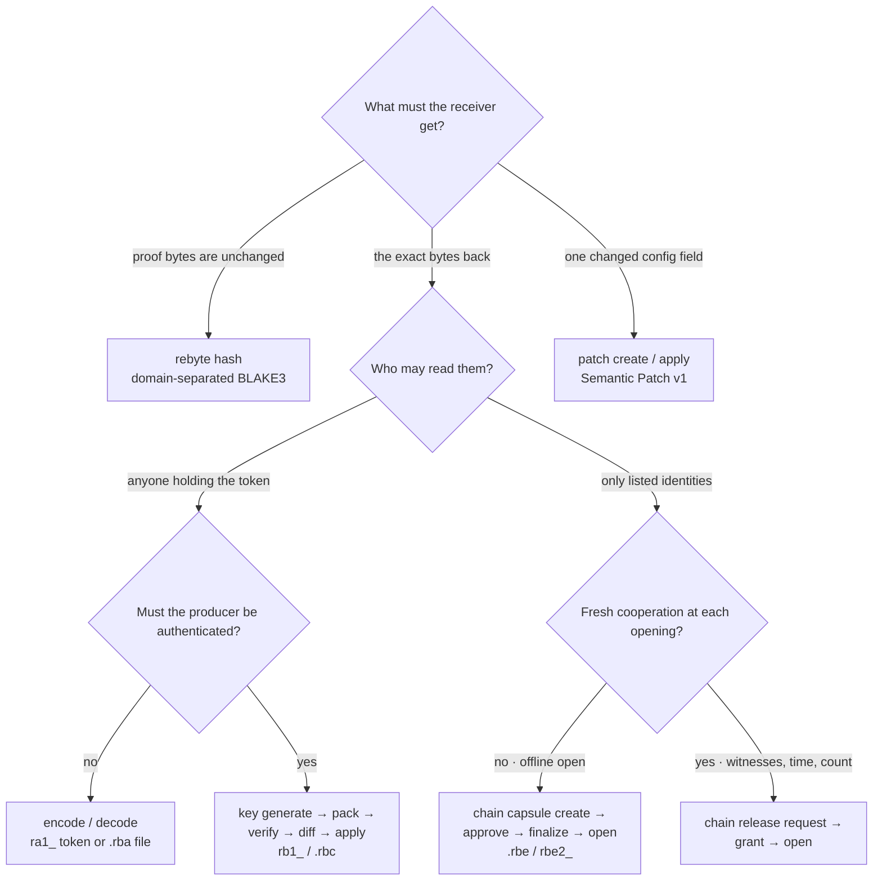
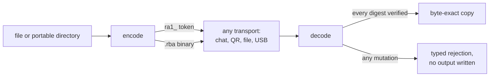
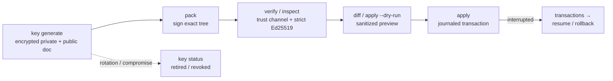
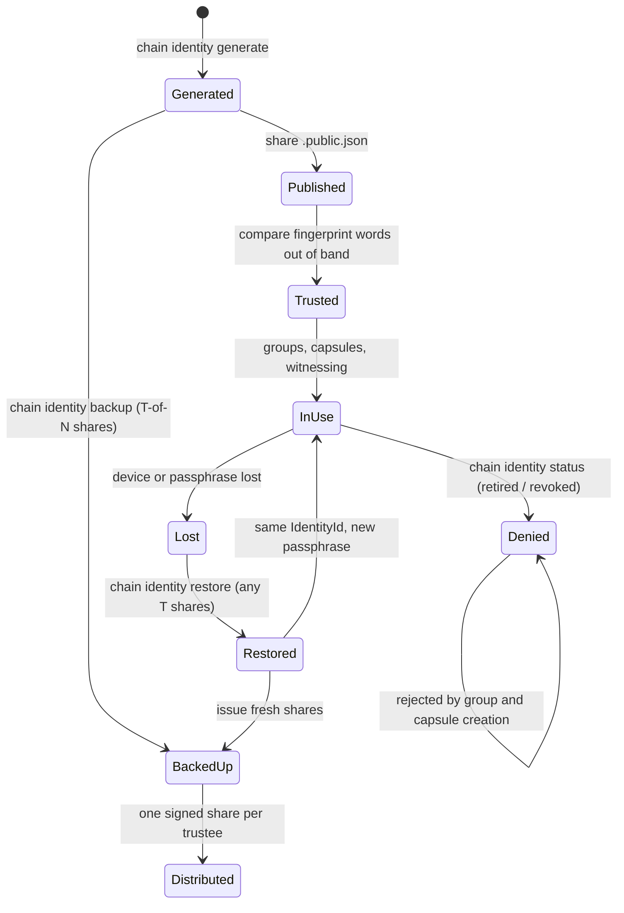
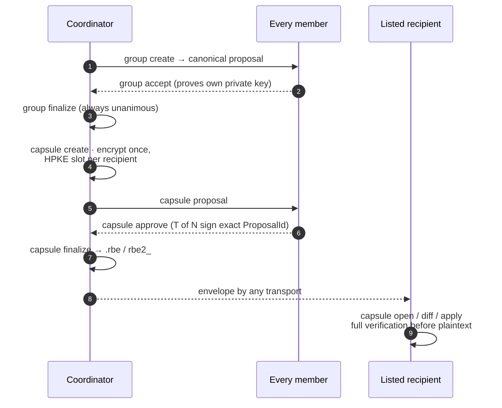
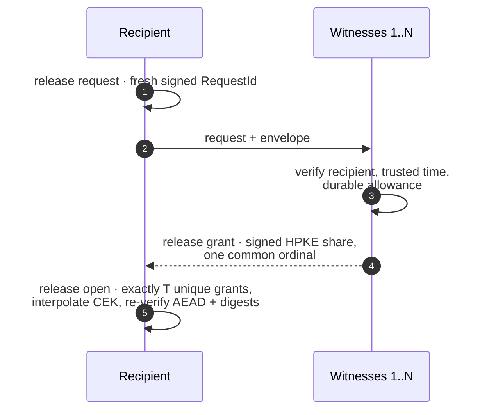
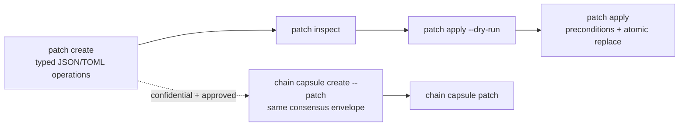
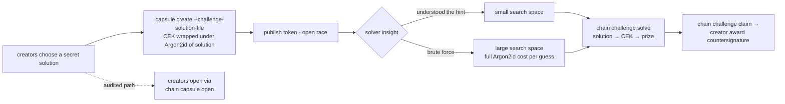

# Rebyte usage flows

Copyright (c) 2026 Pedro Martins (pedro5g)

This page maps every implemented Rebyte workflow as a diagram, so a reader can
see the complete space of possibilities before choosing one. Each section
links to the reference that freezes its exact behavior. Draft capabilities are
explicitly marked and are not part of any release.

## Choosing a flow



Properties never upgrade silently: a digest is not a signature, a signature is
not encryption, and encryption to a recipient is not fresh consent. The
[concepts guide](concepts.md) explains each rung; the
[security model](security-model.md) freezes the verification order.

## Unsigned artifact



No key, no identity: corruption detection only. Reference:
[Artifact Token v1](../schemas/artifact-token-v1.md).

## Signed publisher capsule



Trust is local and explicit: verifiers accept only keys they were given.
References: [RAP v1](../schemas/rap-v1.md), [key management](key-management.md).

## Chain identity lifecycle



The proquint fingerprint (sixteen pronounceable words shown by `generate` and
`inspect`) exists for the `Published → Trusted` edge: read the words aloud
over an independent channel before admitting an identity to a group.

### Threshold backup ceremony

```mermaid
sequenceDiagram
    autonumber
    participant O as Owner
    participant T as Trustees 1..N
    participant R as Recovery machine
    O->>O: unlock .rbk, split both seeds T-of-N
    O->>T: one signed share document each
    Note over T: below T shares reveal nothing;<br/>any T shares are the identity
    O--xO: bundle or passphrase lost
    T-->>R: T distinct shares collected
    R->>R: verify share signatures and identity binding
    R->>R: reconstruct seeds, verify against public identity
    R->>R: re-encrypt .rbk under a new passphrase
    R->>O: same IdentityId restored
```

Shares carry no passphrase protection by design: guard each one like a secret
and never store two shares together. Operational guidance lives in the
[Chain operations runbook](chain-operations.md).

## Group consensus and direct capsule



Controllers, recipients and capabilities are independent sets bound by the
Access Contract; changing any protected field invalidates every approval.
References: [Chain v2](../schemas/chain-v2.md),
[Access Contract v1](../schemas/access-contract-v1.md),
[Chain architecture](chain-architecture.md).

## Quorum release session



Rolling back a single witness ledger only desynchronizes its ordinal and the
open fails closed; defeating a finite release limit requires consistently
rolling back every witness. The CLI file ledger needs
`--acknowledge-local-authority`; production requires protected `TrustedClock`
and `ReleaseLedger` providers.

## Semantic patch



Patch values are inert data; nothing is executed. Standalone patches are
unsigned local instructions — carry them inside Chain when authorship and
authorization matter. Reference:
[Semantic Patch v1](../schemas/semantic-patch-v1.md).

## Challenge capsule



A challenge is a cost gate, not access control: anyone holding the envelope
may search, the race is irrevocable after publication, and real confidential
data must never sit behind one. Reference:
[Challenge v1](../schemas/challenge-v1.md).

## Draft flows — not implemented

The following diagram describes a design draft only
([Key Sequence v1](../schemas/key-sequence-v1.md)). No release implements it.

### Key sequence (draft)


The gain is custody separation — each key on a different device or location.
Keys are never derived from other keys; every position is an ordinary
identity with its own backup lifecycle.
