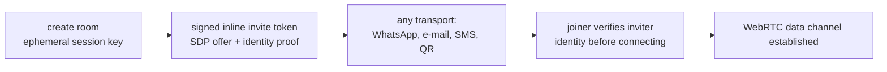
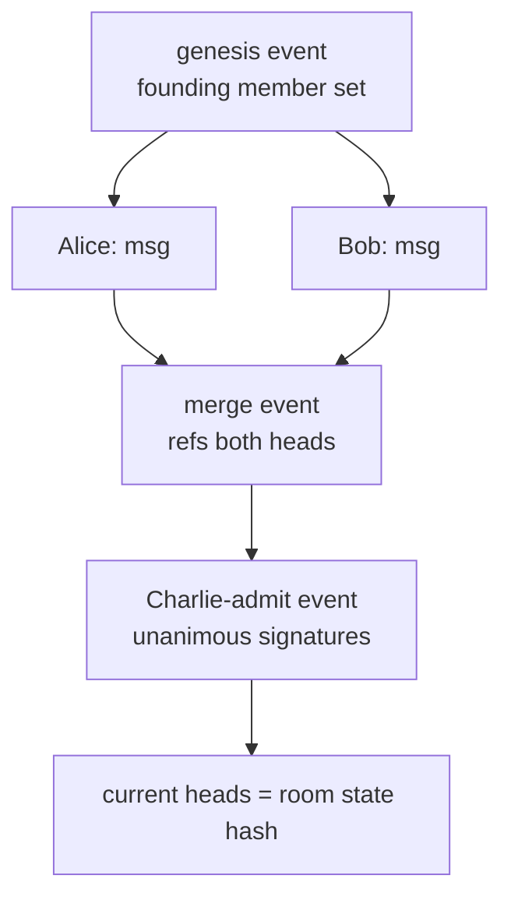
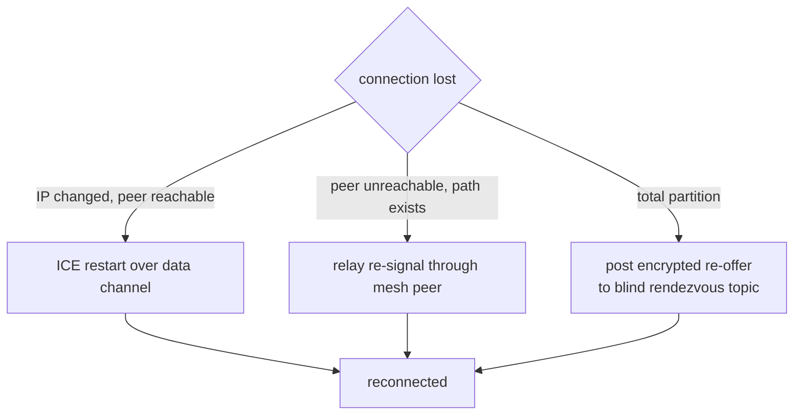
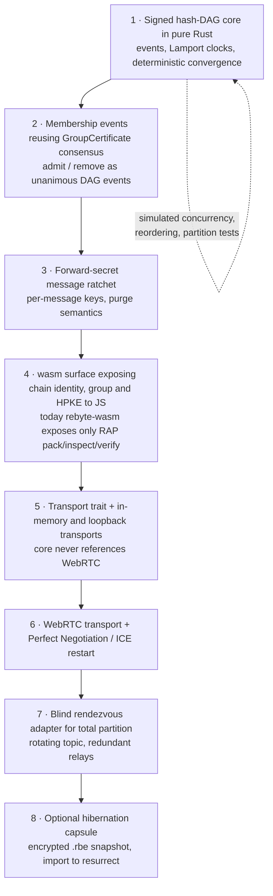

# Rebyte Ephemeral Mesh v1 — draft

Copyright (c) 2026 Pedro Martins (pedro5g)

Status: design draft. No release implements this document. It records a
primitive, not a product: a consensus-bound, tamper-evident, transport-
agnostic ephemeral group-state structure. A real-time chat room is the
canonical demonstration of the primitive, not a messaging product competing
with Signal, Briar or MLS-based tools. Field names, domains, limits and wire
formats are not frozen; frozen behavior and canonical vectors will be
recorded here before any implementing release.

## What this is, and what it is not

The Rebyte novelty is not the cryptography — group key agreement is solved
art ([MLS RFC 9420](https://www.rfc-editor.org/rfc/rfc9420), the Signal
protocol) and tamper-evident event graphs are solved art (Matrix, Secure
Scuttlebutt, Automerge). The novelty is the **synthesis and the operator
model**: one tamper-evident structure that carries membership *and* history,
bound by unanimous consent, that runs with **no party that must be trusted**
— not even the author of the software.

This document specifies that primitive. It deliberately does not promise mass
adoption, push notifications, account recovery or a business model; those are
product concerns that the primitive does not solve and must not pretend to.

## The organizing principle: no *trusted* party, not no server

Rebyte already sends a `.rbe` capsule over Gmail. Gmail is a server and is
infrastructure, but it is not *trusted*, because it can neither read nor
forge the content. That is the real invariant of the whole project, and it is
the single test every mesh component must pass:

> Can this component read plaintext, forge accepted state, or censor
> undetectably? If no, it is permitted — even if it is a server.

Applying the test:

| Component | Reads plaintext? | Forges state? | Undetectable censorship? | Verdict |
|---|---|---|---|---|
| STUN (returns your own address) | no | no | no | allowed |
| Blind rendezvous relay (opaque, encrypted blobs) | no | no | no (redundant, routable-around) | allowed |
| The mesh peers themselves | yes (they are members) | no (unanimous signatures) | no (DAG integrity) | allowed |
| A sequencer that orders messages | no | no | **yes** | **forbidden** |

The forbidden row is why §2 replaces a central sequencer with a locally
convergent hash-DAG. "Serverless" is not the invariant; **"no trusted
party" is.**

## 1. Invite-contract (initial signaling, out of band, exactly once)

Room creation mints an ephemeral session keypair and packs the initiator's
SDP offer plus identity proof into one signed inline token, delivered over any
channel (WhatsApp, e-mail, SMS). The token authenticates *who* invited before
any connection exists. This is the only step that needs the out-of-band
channel: once one data channel is live, the channel itself carries all
further signaling (§4).



## 2. Tamper-evident state: signed hash-DAG, not a hash-chain

A linear `hash(previous + current + members)` chain assumes total order.
A mesh has concurrency: two members send near-simultaneously and each peer
receives a different order through normal jitter. A strict chain reports that
as *tampering* — a false positive that breaks the room on day one.

The correct structure is a **signed Merkle-DAG** (as Git, Matrix and SSB
use):

- Every event references the hash(es) of the event(s) its author had already
  seen — its current *heads*. Concurrency is two branches that later merge,
  represented naturally rather than rejected.
- Each event is signed by its author's Rebyte identity and carries a Lamport
  clock. Display order converges locally and deterministically by
  `(lamport, author_pubkey, event_hash)`; every peer reaches the same order
  with no central sequencer.
- Tamper-evidence is preserved: a forged parent hash cannot be produced, so
  injected or replayed events fail to attach and are ejected — but legitimate
  reordering is never punished.



## 3. Membership as events inside the same DAG

Adding a member is not a side channel: it is an event in the DAG whose payload
is the unanimous acceptance signatures of every current member, referencing
the heads at that moment. This reuses the exact discipline of Rebyte's
`GroupCertificate` (unanimous N-of-N formation, `GroupId` committing the
sorted member set) — the room's membership contract and its message history
become **one canonical tamper-evident structure**. The "dynamic room hash" the
design set out to build is precisely the set of current DAG heads, or a
periodic signed checkpoint over them.

```mermaid
sequenceDiagram
    autonumber
    participant A as Alice (member)
    participant B as Bob (member)
    participant C as Charlie (joiner)
    A->>B: admit-Charlie proposal, refs current heads
    B->>A: signed acceptance
    A->>A: unanimity reached (all current members signed)
    A-->>C: admit event + room head checkpoint
    C->>C: verify every signature and head lineage
    C->>A: join; new heads include the admit event
```

## 4. Liveness across mobile networks (the real problem, not IPv6)

IPv6 does not remove ICE: carrier stateful firewalls, NAT66 and — above all —
**IP changes on network handoff** (tower change, 4G↔5G↔Wi-Fi, background
kill) still apply. The mitigations, in order:

1. **Re-signal over the live data channel.** After one connection exists, an
   IP change triggers an ICE restart whose new candidates flow over the
   existing encrypted channel (Perfect Negotiation). No new invite needed.
2. **The mesh is its own rendezvous.** If Alice↔Bob drops but Alice↔Charlie
   and Charlie↔Bob live, Charlie relays the re-signaling. Only a *total*
   partition needs external help.
3. **Blind rendezvous for total partition.** Derive a rotating topic from the
   shared room key (`BLAKE3(room_key || epoch)`) and post an encrypted
   re-offer to a content-blind, redundant store (e.g. several Nostr relays).
   The relay never holds the key and is replaceable — it passes the trust
   test. Embed a public STUN candidate in the invite as a cheap first hop.



Honest tension: you cannot have *both* zero infrastructure *and* reconnect
after every peer moved networks with the app closed. Something must hold a
forwardable message — but it can be blind, encrypted, redundant and
replaceable, which preserves the invariant.

## 5. Forward secrecy and the purge

Per-session ephemeral keys are not enough; ratchet the message key forward
(double-ratchet discipline) so a RAM dump mid-session exposes only a small
window and the *past* is unrecoverable even to a member — the purge stops
depending on client good faith for history already sent.

The "messages vanish when you leave" behavior is a **default and a
convention**, not an enforced guarantee: a modified client or a screen
photograph defeats it, and the spec must say so plainly. What it honestly
delivers is reducing the *post-conversation* attack surface to near zero on
honest machines, not preventing a determined leak.

## 6. Attributable vs deniable — an open decision

A signed event is *attributable*: a leaked transcript is provably from a
specific member. The opposite design (shared-key MACs, OTR-style) is
*deniable*: a leaked transcript proves nothing against anyone. These are
mutually exclusive cryptographic choices and Signal deliberately chose
deniability. For a high-stakes decision room, attributable is the likely
answer; for a secret conversation that must not be usable as evidence,
deniable is. **This must be decided per threat model before implementation**
and is not yet fixed.

## 7. Transport-agnostic core (the architectural invariant)

The DAG, membership and encryption must not know whether bytes travel over
WebRTC, a Nostr relay, a QR code or a USB stick — exactly as a `.rbe` does not
know whether it travels over Gmail or USB. WebRTC becomes *one transport*, and
the IPv6/liveness questions become *one transport's* problem. All security
lives in the core, which is pure Rust and testable to the project's coverage
bar with an in-memory transport.

## Remaining work — flowchart, ordered by risk

Build by the riskiest unknown first, never by what is easy or visible. The
DAG convergence model is the intellectual content and is testable in pure Rust
with zero network; prove it before writing one line of WebRTC.



Convergence is proven when, for every permutation and partition of a fixed
event set, all honest peers derive one identical ordered history and one
identical head checkpoint, and every injected or replayed event fails to
attach.

## Explicit limits

- **Adoption, not cryptography, is the hard constraint.** A secure room nobody
  you talk to uses is a science project. This primitive is valuable as a
  reference implementation and, at most, as a narrow vertical tool (auditable-
  yet-ephemeral decision rooms), not as a mass-market messenger.
- **Serverless taxes UX.** No server means no reliable mobile push, no async
  delivery to an offline peer, no account recovery. These are inherent, not
  bugs.
- **Do not ship unaudited group crypto as a life-safety promise.** If real
  high-risk users are ever targeted, adopt MLS (RFC 9420) rather than a
  bespoke scheme; the bespoke DAG here is a research and demonstration
  artifact.
- **Full-mesh scales to small rooms.** Text mesh is fine to a few dozen peers;
  the cost is connection churn on join/leave, not bandwidth. Large rooms need
  a different topology and are out of scope for v1.
- **Screenshots and modified clients are outside the model**, as with every
  end-to-end system.

## Abuse cases required in tests

Concurrent events reordered across peers; a replayed event re-posted into
another room; an event with a forged parent hash; an admit event missing one
member's signature; a member forging membership without unanimity; two peers
resurrecting from hibernation capsules with divergent heads; a partition
healed with conflicting branches; and a relayed re-offer bound to the wrong
room topic.
